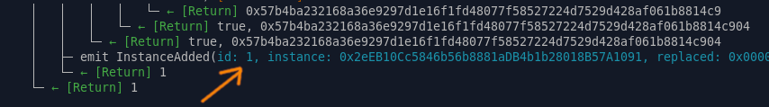

# Setup of the Moonchain Miner


## Install the Ubuntu Server 22.04 (LTS)


## Basic setup on host system

Update the system

```
sudo apt update && sudo apt upgrade -y
```


If the Linux Kernel is not 6.x, please update it. After updated, please reboot.

```
sudo apt install -y linux-image-6.8.0-49-generic
```


Install basic host packages

```
sudo apt install -y vim openssl net-tools inetutils-ping cmake apt-utils git ssh build-essential unzip curl wget pkg-config libssl-dev libcap-dev jq tzdata cpuid gawk clang python-is-python3 debhelper zip libcurl4-openssl-dev libboost-dev libboost-system-dev libboost-thread-dev protobuf-c-compiler libprotobuf-c-dev protobuf-compiler

sudo apt install --reinstall ca-certificates && sudo update-ca-certificates --fresh
```


Install docker

```
sudo curl -fsSL https://download.docker.com/linux/ubuntu/gpg -o /etc/apt/keyrings/docker.asc
sudo chmod a+r /etc/apt/keyrings/docker.asc
echo \
  "deb [arch=$(dpkg --print-architecture) signed-by=/etc/apt/keyrings/docker.asc] https://download.docker.com/linux/ubuntu \
  $(. /etc/os-release && echo "$VERSION_CODENAME") stable" | \
  sudo tee /etc/apt/sources.list.d/docker.list > /dev/null
  
sudo apt update
sudo apt install -y docker-ce docker-ce-cli containerd.io docker-buildx-plugin docker-compose-plugin
```


Install nodejs

```
curl -s https://deb.nodesource.com/setup_20.x | sudo bash
sudo apt install -y nodejs
```


Install Gramine

```
sudo curl -fsSLo /etc/apt/keyrings/gramine-keyring-$(lsb_release -sc 2>/dev/null).gpg https://packages.gramineproject.io/gramine-keyring-$(lsb_release -sc 2>/dev/null).gpg
echo "deb [arch=amd64 signed-by=/etc/apt/keyrings/gramine-keyring-$(lsb_release -sc 2>/dev/null).gpg] https://packages.gramineproject.io/ $(lsb_release -sc 2>/dev/null) main" | sudo tee /etc/apt/sources.list.d/gramine.list

sudo curl -fsSLo /etc/apt/keyrings/intel-sgx-deb.asc https://download.01.org/intel-sgx/sgx_repo/ubuntu/intel-sgx-deb.key
echo "deb [arch=amd64 signed-by=/etc/apt/keyrings/intel-sgx-deb.asc] https://download.01.org/intel-sgx/sgx_repo/ubuntu $(lsb_release -sc) main" | sudo tee /etc/apt/sources.list.d/intel-sgx.list

sudo apt update
sudo apt install -y gramine sgx-pck-id-retrieval-tool
```


Check FMSPC, it should be `00706A800000`.

```
echo "Please enter Intel's PCS Service API key" && read -r API_KEY && sudo PCKIDRetrievalTool -f /tmp/pckid.csv && pckid=$(cat /tmp/pckid.csv) && ppid=$(echo "$pckid" | awk -F "," '{print $1}') && cpusvn=$(echo "$pckid" | awk -F "," '{print $3}') && pcesvn=$(echo "$pckid" | awk -F "," '{print $4}') && pceid=$(echo "$pckid" | awk -F "," '{print $2}') && curl -v "https://api.trustedservices.intel.com/sgx/certification/v4/pckcert?encrypted_ppid=${ppid}&cpusvn=${cpusvn}&pcesvn=${pcesvn}&pceid=${pceid}" -H "Ocp-Apim-Subscription-Key:${API_KEY}" 2>&1 | grep -i "SGX-FMSPC"
```

You may use this API key `15e0d4d1d14649748766201fc4b22c9c`.


## Init raiko

Setup PCCS. Answer the cert info with, Country Name=DE, State=Berlin, Organization Name=moonchain, Common Name=moonchain. Leave it blank for others which not mentioned.

```
mkdir -p ~/.config/sgx-pccs
cd ~/.config/sgx-pccs
openssl genrsa -out private.pem 2048
chmod 644 private.pem  # Docker container needs access
openssl req -new -key private.pem -out csr.pem
openssl x509 -req -days 365 -in csr.pem -signkey private.pem -out file.crt
rm csr.pem
curl -s https://raw.githubusercontent.com/taikoxyz/raiko/refs/heads/main/docs/default.json > ~/.config/sgx-pccs/default.json
```

Modify the following lines in `~/.config/sgx-pccs/default.json`. The `UserTokenHash` is a hash value generated from the string `UserPassword`. The `AdminTokenHash` is a hash value generated from the string `AdminPassword`.

```
    "hosts" : "0.0.0.0",
    "ApiKey": "15e0d4d1d14649748766201fc4b22c9c",   
    "UserTokenHash" : "084c5241ca7619e93430eac6ccc6fd009a7ddcf21b94aadad9fdf52857779421e94aa672a99873033bbe6805906d6f74df9e3bf476858980f96df5881a960906",
    "AdminTokenHash" : "cf1aaeefbebc761a2583e0a985553b9f1045f6f5b6c7bf1a1ee8abdb2ed9ce3ce4a844bc010f6ab0338dd24457fc6f6fd573aafcbf894ddfabbaa0af9f1924f2",
```


Prepare raiko folder

```
rm -Rf ~/.config/raiko/config
rm -Rf ~/.config/raiko/secrets
mkdir -p ~/.config/raiko/config
mkdir -p ~/.config/raiko/secrets
```


Download and import the docker image

```
cd /tmp
wget https://github.com/ian-lee-mxc/raiko/releases/download/ian-pre-release-20241231/raiko_20241231.zip
unzip raiko_20241231.zip
docker image load -i raiko_20241231.tar
docker pull us-docker.pkg.dev/evmchain/images/pccs:latest
```


Clone the source

```
mkdir -p ~/moonchain
cd ~/moonchain
git clone git@github.com:ian-lee-mxc/raiko.git -b ian-moonchain
```


Init raiko

```
cd ~/moonchain/raiko/docker
docker compose up init
```

After a successful initialisation, you will get a quote (a long string of hex digit). This quote also saved to `~/.config/raiko/config/bootstrap.json`. You need this quote to register the proofer to Moonchain.


## Register proofer to Moonchain

This step will interact with a L1 contract, means Arbitrum One for Moonchain Mainnet and Arbitrum Sepolia fro Moonchain Geneva Testnet. You will need some ETH on Arbitrum side to complete the process.

*PS: This process can perform on another machine, such as a backend server.*


Clone the source

```
mkdir -p ~/moonchain
cd ~/moonchain
git clone git@github.com:ian-lee-mxc/mxc-mono.git -b ian/moonchain-raiko
cd mxc-mono
git submodule init
git submodule update
cd mxc-mono/packages/protocol
pnpm install
pnpm compile
```


Check the contract address  setting in`script/config_dcap_sgx_verifier.sh`, and make it match with your target chain.

For Moonchain Geneva Testnet.

```
SGX_VERIFIER_ADDRESS=0x7FF12AC8385e67970eBB8aEAc6c42c133E690649 ATTESTATION_ADDRESS=0x3e0c0dAB767FE8BA386175F0d4C92D45A1A6A4Df PEM_CERTCHAIN_ADDRESS=0x20e01bbfd507a0a2d04bc6d06944d8c9ed7bc5fa
```

For Moonchain Mainnet.

```
SGX_VERIFIER_ADDRESS=
ATTESTATION_ADDRESS=
PEM_CERTCHAIN_ADDRESS=
```


Register the proofer with the quote you got from raiko initialization.

For Moonchain Geneva Testnet.

```
export PRIVATE_KEY=<YOUR PRIVATE KEY with leading 0x>
export FORK_URL=https://sepolia-rollup.arbitrum.io/rpc
./script/config_dcap_sgx_verifier.sh --quote <QUOTE FROM raiko INIT>
```

For Moonchain Mainnet.

```
export PRIVATE_KEY=<YOUR PRIVATE KEY with leading 0x>
export FORK_URL=https://arbitrum.llamarpc.com
./script/config_dcap_sgx_verifier.sh --quote <QUOTE FROM raiko INIT>
```

On success, you will get the instance id of your proofer.




## Run raiko

For Moonchain Geneva Testnet.

```
cd ~/moonchain/raiko/docker
export SGX_INSTANCE_ID=<YOUR_INSTANCE_ID>
export L1_NETWORK="arbitrum_sepolia"
export NETWORK="moonchain_geneva"
docker compose up raiko -d
```

For Moonchain Mainnet.

```
cd ~/moonchain/raiko/docker
export SGX_INSTANCE_ID=<YOUR_INSTANCE_ID>
export L1_NETWORK="arbitrum_one"
export NETWORK="moonchain_mainnet"
docker compose up raiko -d
```

